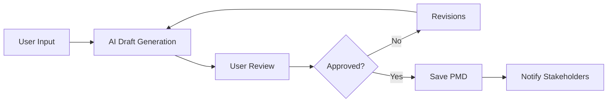
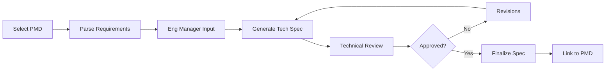
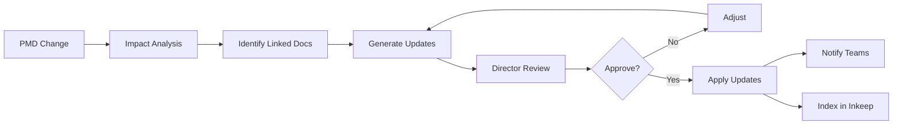
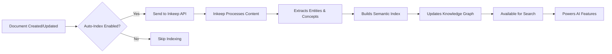
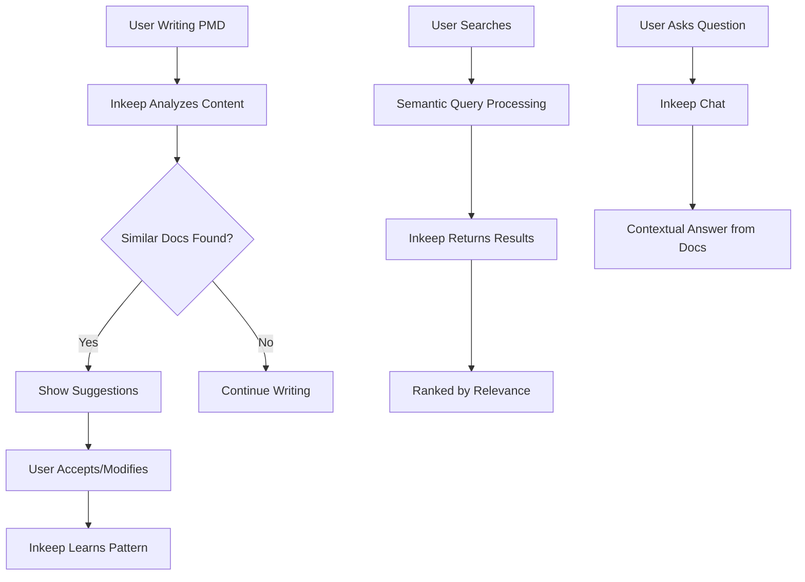

# PM Assistant System Design Document

## Executive Summary

The PM Assistant is an AI-powered tool designed to streamline product management workflows by automating document generation and maintaining consistency across PMDs (Product Management Documents), engineering specifications, and related artifacts. The system leverages LLMs to generate initial drafts, incorporate stakeholder feedback, and maintain document synchronization throughout the product development lifecycle.

**Inkeep Integration**: The system uses Inkeep as its intelligent knowledge base, transforming static documents into a searchable, learning system. Inkeep ingests all documentation, understands the content semantically, and provides context-aware assistance. This means the system gets smarter over time, learning from your organization's documentation patterns to provide increasingly relevant suggestions, validate content against established practices, and help maintain consistency across all product artifacts.

## System Overview

### Vision
Create an intelligent assistant that reduces the administrative burden on product managers by automating document creation and updates while maintaining high quality and consistency across all product artifacts. Inkeep integration transforms this from a simple document generator into a learning system that understands and improves based on your organization's documentation patterns.

### Core Capabilities
1. **PMD Generation**: AI-assisted creation of comprehensive product management documents
2. **Spec Building**: Transform PMDs into technical specifications with engineering input
3. **Document Synchronization**: Automatic updates across related documents based on changes
4. **Intelligent Search & Context**: Inkeep-powered semantic search and contextual assistance
5. **Voice Interface**: Optional speech-to-text for hands-free document creation

## Architecture

### High-Level Architecture

```
┌─────────────────────────────────────────────────────────────┐
│                         User Interface                       │
│  ┌──────────────┐  ┌──────────────┐  ┌─────────────────┐  │
│  │   Web UI     │  │   Voice UI   │  │   API Client    │  │
│  └──────────────┘  └──────────────┘  └─────────────────┘  │
└─────────────────────────────────────────────────────────────┘
                              │
                              ▼
┌─────────────────────────────────────────────────────────────┐
│                       API Gateway                            │
│  ┌──────────────────────────────────────────────────────┐  │
│  │              FastAPI REST/WebSocket                   │  │
│  └──────────────────────────────────────────────────────┘  │
└─────────────────────────────────────────────────────────────┘
                              │
                              ▼
┌─────────────────────────────────────────────────────────────┐
│                    Core Services Layer                       │
│  ┌────────────┐  ┌────────────┐  ┌──────────────────┐     │
│  │  Document  │  │    LLM     │  │   Workflow       │     │
│  │  Generator │  │ Integration│  │   Orchestrator   │     │
│  └────────────┘  └────────────┘  └──────────────────┘     │
│  ┌────────────┐  ┌────────────┐  ┌──────────────────┐     │
│  │  Template  │  │  Version   │  │   Notification   │     │
│  │   Engine   │  │  Control   │  │     Service      │     │
│  └────────────┘  └────────────┘  └──────────────────┘     │
│  ┌────────────┐  ┌────────────┐                            │
│  │   Inkeep   │  │  Document  │                            │
│  │  Service   │  │   Indexer  │                            │
│  └────────────┘  └────────────┘                            │
└─────────────────────────────────────────────────────────────┘
                              │
                              ▼
┌─────────────────────────────────────────────────────────────┐
│                      Data Layer                              │
│  ┌────────────┐  ┌────────────┐  ┌──────────────────┐     │
│  │ PostgreSQL │  │   Redis    │  │   S3/Storage     │     │
│  │  Database  │  │   Cache    │  │   Documents      │     │
│  └────────────┘  └────────────┘  └──────────────────┘     │
└─────────────────────────────────────────────────────────────┘
```

### Component Details

#### 1. Document Generator Service
**Purpose**: Core engine for creating and updating documents

**Responsibilities**:
- Generate PMDs from user inputs and templates
- Transform PMDs into engineering specifications
- Update documents based on stakeholder feedback
- Maintain document consistency

**Key Features**:
- Template-based generation with customizable sections
- Smart merging of stakeholder inputs
- Change tracking and diff generation
- Export to multiple formats (Markdown, PDF, Docx)

#### 2. LLM Integration Layer
**Purpose**: Interface with AI models for content generation

**Supported Models**:
- OpenAI GPT-4/GPT-4o
- Anthropic Claude
- Local models via Ollama

**Features**:
- Prompt engineering and optimization
- Context management for large documents
- Response validation and quality checks
- Cost optimization through caching

#### 3. Workflow Orchestrator
**Purpose**: Manage document lifecycle and approval processes

**Workflows**:
1. **PMD Creation Flow**:
   - Initial draft → Review → Revision → Approval
2. **Spec Generation Flow**:
   - PMD parsing → EM input → Technical draft → Review → Finalization
3. **Update Flow**:
   - Change detection → Impact analysis → Stakeholder notification → Update propagation

#### 4. Template Engine
**Purpose**: Manage document templates and structures

**Templates**:
- PMD templates (by product type/industry)
- Engineering spec templates
- Update notification templates
- Custom user templates

#### 5. Version Control Service
**Purpose**: Track document versions and changes

**Features**:
- Git-like versioning for documents
- Branching for parallel iterations
- Merge conflict resolution
- Rollback capabilities

#### 6. Inkeep Service
**Purpose**: Provide intelligent search and contextual assistance through Inkeep's AI platform

**What Inkeep Does**:
Inkeep is an AI-powered knowledge base platform that transforms your documentation into an intelligent, searchable system. It ingests all your PMDs, specs, and related documents, then uses advanced NLP to understand the content deeply. This enables:
- **Semantic Understanding**: Goes beyond keyword matching to understand intent and context
- **Knowledge Graph**: Builds relationships between documents, concepts, and entities
- **Learning from Patterns**: Identifies common patterns in your organization's documentation
- **Contextual AI Responses**: Provides answers based on your actual documentation, not generic responses

**How It Works in PM Assistant**:
1. **Document Ingestion**: When documents are created/approved, they're sent to Inkeep's API
2. **Smart Indexing**: Inkeep processes content, extracts entities, and builds semantic representations
3. **Query Processing**: User searches/questions are interpreted semantically, not just keyword matching
4. **Contextual Responses**: Returns relevant content with understanding of relationships and context
5. **Continuous Learning**: Improves over time as more documents are added

**Key Capabilities Provided**:
- **Semantic Search**: Find documents by meaning, not just keywords (e.g., "authentication issues" finds docs about login problems, security, access control)
- **Smart Suggestions**: While writing, get suggestions based on similar documents in your knowledge base
- **Validation**: Check if PMDs follow organizational patterns and best practices learned from existing docs
- **Cross-References**: Automatically identify related documents based on content similarity
- **Question Answering**: Ask questions like "What are our standard success metrics for user features?" and get answers from your docs
- **Pattern Recognition**: Identify common structures and content patterns across successful PMDs

**Integration Points**:
- Indexes all approved documents automatically via webhook
- Provides real-time suggestions during document creation
- Validates documents against learned best practices
- Powers semantic search functionality throughout UI
- Enables chat-based assistance using organizational knowledge

#### 7. Document Indexer
**Purpose**: Manage document indexing pipeline with Inkeep

**Features**:
- Automatic indexing on document creation/update
- Bulk indexing capabilities
- Sync between database and Inkeep index
- Background processing with Celery
- Configurable indexing rules

## Data Models

### Document Schema
```python
class Document:
    id: UUID
    type: DocumentType  # PMD, SPEC, PRD, etc.
    title: str
    version: str
    status: DocumentStatus  # DRAFT, REVIEW, APPROVED
    created_by: User
    created_at: datetime
    updated_at: datetime
    content: DocumentContent
    metadata: Dict[str, Any]
    linked_documents: List[UUID]
    stakeholders: List[Stakeholder]
    change_history: List[Change]
```

### PMD Structure
```yaml
pmd:
  header:
    title: string
    product: string
    author: string
    date: date
    version: string
  
  problem_statement:
    description: string
    user_pain_points: list
    business_impact: string
  
  solution:
    overview: string
    key_features: list
    user_stories: list
    success_metrics: list
  
  market_analysis:
    target_audience: string
    competitors: list
    differentiators: list
  
  risks_and_mitigations:
    risks: list
    dependencies: list
    assumptions: list
  
  timeline:
    milestones: list
    release_plan: string
```

### Engineering Spec Structure
```yaml
spec:
  header:
    title: string
    pmd_reference: uuid
    tech_lead: string
    version: string
  
  technical_requirements:
    functional: list
    non_functional: list
    constraints: list
  
  architecture:
    overview: string
    components: list
    data_flow: string
    integrations: list
  
  implementation:
    technology_stack: list
    development_phases: list
    testing_strategy: string
  
  estimates:
    effort: string
    resources: list
    timeline: list
```

## API Design

### RESTful Endpoints

#### Document Operations
```
POST   /api/v1/documents/pmd           # Create new PMD
GET    /api/v1/documents/{id}          # Get document
PUT    /api/v1/documents/{id}          # Update document
DELETE /api/v1/documents/{id}          # Delete document
GET    /api/v1/documents               # List documents

POST   /api/v1/documents/{id}/version  # Create new version
GET    /api/v1/documents/{id}/versions # Get version history
POST   /api/v1/documents/{id}/rollback # Rollback to version
```

#### Workflow Operations
```
POST   /api/v1/workflows/pmd-to-spec   # Generate spec from PMD
POST   /api/v1/workflows/update        # Trigger document updates
GET    /api/v1/workflows/{id}/status   # Get workflow status
POST   /api/v1/workflows/{id}/approve  # Approve workflow step
```

#### LLM Operations
```
POST   /api/v1/generate/pmd            # Generate PMD draft
POST   /api/v1/generate/spec           # Generate spec draft
POST   /api/v1/generate/suggestions    # Get improvement suggestions
POST   /api/v1/generate/summary        # Generate document summary
```

#### Voice Interface (Optional)
```
POST   /api/v1/voice/transcribe        # Convert speech to text
POST   /api/v1/voice/command           # Process voice command
WS     /ws/voice/stream                # Real-time transcription
```

#### Inkeep Operations
```
POST   /api/v1/inkeep/search           # Semantic search
POST   /api/v1/inkeep/chat             # Chat with AI assistant
POST   /api/v1/inkeep/suggestions      # Get content suggestions
POST   /api/v1/inkeep/validate/{id}    # Validate document
GET    /api/v1/inkeep/similar/{id}     # Find similar documents
GET    /api/v1/inkeep/references/{id}  # Get cross-references
POST   /api/v1/inkeep/index/{id}       # Index document
DELETE /api/v1/inkeep/index/{id}       # Remove from index
```

### WebSocket Events
```javascript
// Client → Server
{
  "event": "document.edit",
  "data": {
    "documentId": "uuid",
    "changes": []
  }
}

// Server → Client
{
  "event": "document.updated",
  "data": {
    "documentId": "uuid",
    "updatedBy": "user",
    "changes": []
  }
}
```

## User Interface Design

### Web Application Structure

#### 1. Dashboard
- Recent documents
- Pending reviews
- Activity feed
- Quick actions

#### 2. Document Editor
- Rich text editing with Markdown support
- Side-by-side preview
- AI suggestions panel powered by Inkeep
- Inline content recommendations
- Real-time validation feedback
- Comment threads
- Version comparison

#### 3. Workflow Manager
- Visual workflow status
- Stakeholder inputs
- Approval tracking
- Timeline view

#### 4. Template Library
- Browse templates
- Create custom templates
- Import/export templates
- AI-powered template suggestions based on similar documents

#### 5. Inkeep Search & Assistant
- Global semantic search bar
- Chat interface for document assistance
- Similar document discovery
- Cross-reference explorer
- Best practices validator

### Voice Interface (Optional)

#### Commands
- "Create new PMD for [product name]"
- "Add problem statement: [description]"
- "Generate spec from current PMD"
- "Show me recent changes"
- "Read back the solution section"

#### Implementation
- Web Speech API for browser-based recognition
- Whisper API for server-side processing
- Command parsing with intent recognition
- Context-aware responses

## Workflow Processes

### 1. PMD Creation Workflow



### 2. Spec Generation Workflow



### 3. Document Update Workflow



### 4. Inkeep Integration Workflow



### 5. Inkeep-Powered User Experience



## Technology Stack

### Backend
- **Framework**: FastAPI (Python 3.11+)
- **Database**: PostgreSQL 15
- **Cache**: Redis
- **Queue**: Celery + RabbitMQ
- **Storage**: AWS S3 or MinIO

### Frontend
- **Framework**: React 18 + TypeScript
- **State Management**: Redux Toolkit
- **UI Components**: Material-UI or Ant Design
- **Editor**: TipTap or Slate.js
- **Charts**: Recharts

### AI/ML
- **LLM APIs**: OpenAI, Anthropic
- **Knowledge Base**: Inkeep AI for semantic search and contextual assistance
- **Embeddings**: OpenAI Ada or Sentence Transformers
- **Speech**: Whisper API or Web Speech API

### Infrastructure
- **Container**: Docker + Docker Compose
- **Orchestration**: Kubernetes (production)
- **CI/CD**: GitHub Actions
- **Monitoring**: Prometheus + Grafana
- **Logging**: ELK Stack

## Security Considerations

### Authentication & Authorization
- OAuth 2.0 / SAML for SSO
- Role-based access control (RBAC)
- Document-level permissions
- API key management for integrations

### Data Protection
- Encryption at rest (AES-256)
- Encryption in transit (TLS 1.3)
- PII detection and masking
- Audit logging for compliance

### LLM Security
- Prompt injection prevention
- Content filtering
- Rate limiting
- Cost controls
- Data sanitization

## Performance Requirements

### Response Times
- Document load: < 2 seconds
- AI generation: < 10 seconds
- Search: < 500ms
- Auto-save: < 100ms

### Scalability
- Support 1000+ concurrent users
- Handle documents up to 100MB
- Process 100+ workflows simultaneously
- Store 1M+ document versions

### Availability
- 99.9% uptime SLA
- Automatic failover
- Data redundancy
- Disaster recovery plan

## Development Phases

### Phase 1: MVP (Weeks 1-4)
- Basic PMD generation
- Simple web interface
- OpenAI integration
- Document storage

### Phase 2: Core Features (Weeks 5-8)
- Spec generation workflow
- Engineering manager interface
- Version control
- Template system

### Phase 3: Advanced Features (Weeks 9-12)
- Document update automation
- Stakeholder collaboration
- Advanced AI features
- Analytics dashboard

### Phase 4: Optional Features (Weeks 13-16)
- Voice interface
- Mobile application
- Advanced integrations
- Custom workflows

## Success Metrics

### Efficiency Metrics
- 70% reduction in document creation time
- 50% reduction in revision cycles
- 80% first-draft acceptance rate

### Quality Metrics
- Document completeness score > 90%
- Stakeholder satisfaction > 4.5/5
- Consistency score > 95%

### Adoption Metrics
- 80% PM team adoption within 3 months
- 100+ documents created monthly
- 90% active user retention

## Risk Mitigation

### Technical Risks
- **LLM API failures**: Implement fallback models and caching
- **Data loss**: Regular backups and version control
- **Performance issues**: Horizontal scaling and optimization

### Business Risks
- **Low adoption**: User training and change management
- **Cost overruns**: Usage monitoring and budget alerts
- **Compliance issues**: Regular audits and certifications

## Future Enhancements

### Short-term (3-6 months)
- Jira/Confluence integration
- Slack notifications
- Custom branding
- Advanced analytics

### Long-term (6-12 months)
- ML-powered insights
- Predictive document generation
- Multi-language support
- Industry-specific templates

### Vision (12+ months)
- Autonomous PM assistant
- Real-time collaboration
- AR/VR document visualization
- Blockchain-based approvals

## Appendices

### A. Glossary
- **PMD**: Product Management Document
- **EM**: Engineering Manager
- **LLM**: Large Language Model
- **RBAC**: Role-Based Access Control
- **Inkeep**: AI-powered knowledge base and search platform

### B. References
- OpenAI API Documentation
- Inkeep AI API Documentation
- FastAPI Best Practices
- React Design Patterns
- Product Management Standards

### C. Configuration Examples
```yaml
# config/app.yaml
app:
  name: "PM Assistant"
  version: "1.0.0"
  environment: "production"

database:
  host: "localhost"
  port: 5432
  name: "pmhelper"

llm:
  provider: "openai"
  model: "gpt-4"
  temperature: 0.7
  max_tokens: 2000

inkeep:
  api_key: "${INKEEP_API_KEY}"
  integration_id: "${INKEEP_INTEGRATION_ID}"
  auto_index: true
  enable_chat: true
  enable_search: true

cache:
  redis_url: "redis://localhost:6379"
  ttl: 3600
```

### D. Sample API Requests
```bash
# Create PMD
curl -X POST https://api.pmhelper.com/v1/documents/pmd \
  -H "Authorization: Bearer token" \
  -H "Content-Type: application/json" \
  -d '{
    "title": "New Feature PMD",
    "product": "ProductName",
    "problem_statement": "Users need..."
  }'

# Generate Spec
curl -X POST https://api.pmhelper.com/v1/workflows/pmd-to-spec \
  -H "Authorization: Bearer token" \
  -H "Content-Type: application/json" \
  -d '{
    "pmd_id": "uuid",
    "engineering_input": {...}
  }'
```